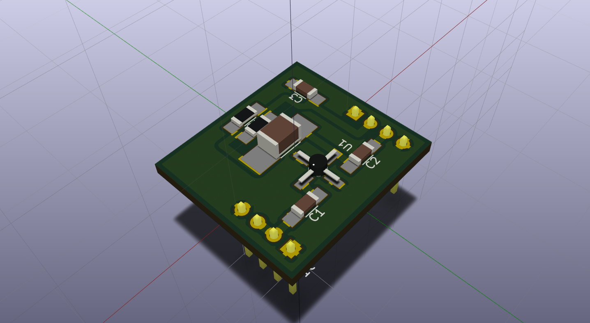
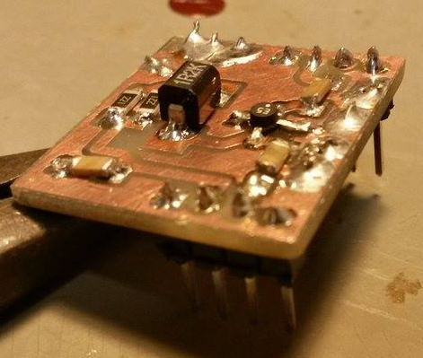

# ERA-5+ RF Amplifier board

Evaluation board for *[EVA-5+](https://www.minicircuits.com/WebStore/dashboard.html?model=ERA-5%2B)*
amplifier from [Mini-Circuits®](http://www.minicircuits.com).






## project structure

```
.
├── 3d_models
├── datasheets
├── era-5_rf_amplifier.bak
├── era-5_rf_amplifier.kicad_pcb
├── era-5_rf_amplifier.pro
├── era-5_rf_amplifier.sch
├── images
├── lib_fp.pretty
├── lib_schm
├── pdf
└── README.md
```
